# Excuse me!

"Excuse me" a Python terminal application deployed on Heroku.
The Excuse Generator App is a fun application designed to help users create unique and plausible excuses for any situation.
Whether you're looking to avoid a meeting, skip an event, or simply get out of a tricky situation, our app has got you covered.

The deployed version of the app can be accessed [here](https://excuse-me-fe33fb7ffa8d.herokuapp.com/)

Google Sheet (view only) [here.](https://docs.google.com/spreadsheets/d/1gNPjJa_Dcd1mdzmPWuY7RFV419DvwEJb8JBrkBt6M9g/edit?usp=sharing)

## User Experience (UX)

### Site Purpose
Our site is dedicated to providing users with a quick and easy way to create convincing excuses for any situation.
Whether you need a way out of a work meeting, an excuse for being late to a social event, or just a fun reason to avoid a task, Excuse Me has you covered.
### Audience
Excuse Me is perfect for anyone needing a quick, creative excuse, including:

- Professionals: Get out of meetings, extend deadlines, or take personal days with work-related excuses.
- Students: Find excuses for being late, missing homework, or taking a break from studies.
- Social Butterflies: Avoid social events or awkward situations with ease.
- Busy Parents: Generate excuses for school events, family gatherings, and more.
- Anyone in a Pinch: Handle unexpected situations with ready-made excuses.
- No matter who you are, Excuse Me helps you navigate life's little challenges with creativity and humor.

### User Goals
At Excuse Me, we aim to help our users achieve their goals by providing a simple and effective excuse generation tool. Our users come to us with the following goals:

- Save Time: Quickly generate excuses without the hassle of thinking them up yourself.
- Avoid Awkward Situations: Seamlessly navigate tricky or uncomfortable scenarios with believable excuses.
- Reduce Stress: Alleviate the pressure of finding a way out of commitments or responsibilities.
- Add Humor to Life: Enjoy the fun and creativity of using and sharing amusing excuses.

### Flowchart

## Features
- At the main page, select one of three options.

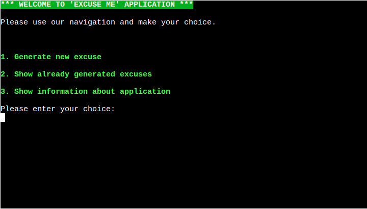
#### First main page option
- First main page option takes to the excuse generator page.
- Script start from input for username.

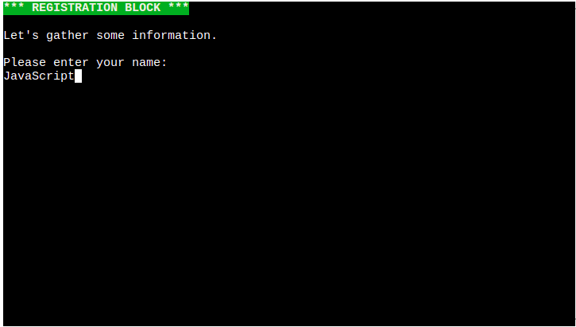
- If the username is valid, show input to enter the name to excuse.

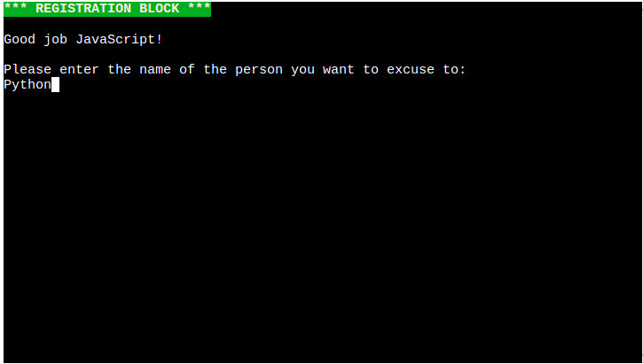
- If the name to excuse is valid, show excuse generator page.

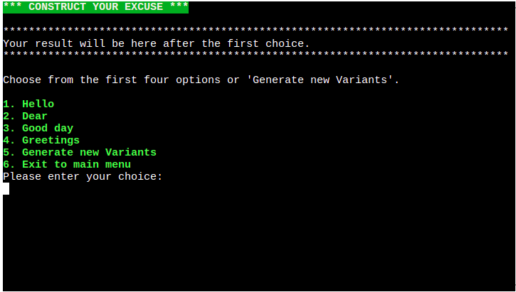
- If select fifth option "Generate new Variants" at excuse generator page set new four options to the menu.
- If select one from first four options, add selected variant to the result and show second step of excuse generator page.

- From this step and all next steps present option "Step Back" which return to previous page and remove last item from excuse result.
- If select one from first four options, add selected variant to the result and show third step of excuse generator page.

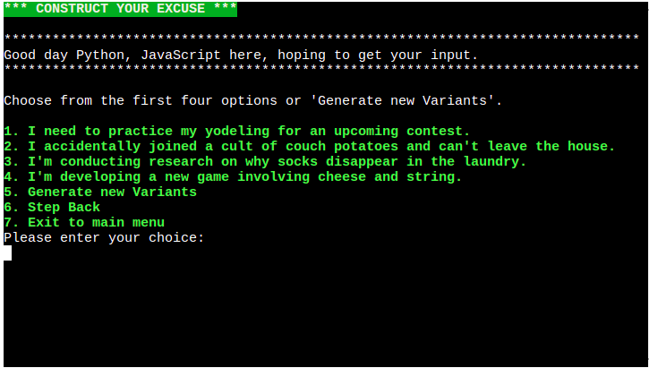
- If select one from first four options, add selected variant to the result and show fourth step of excuse generator page

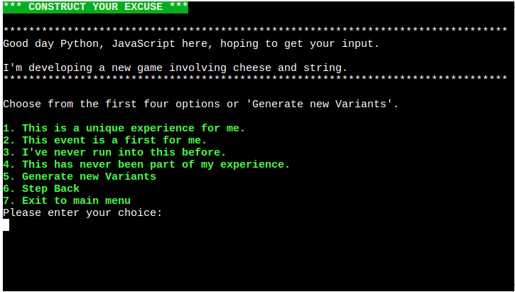
- If select one from first four options, add selected variant to the result and show fifth step of excuse generator page.

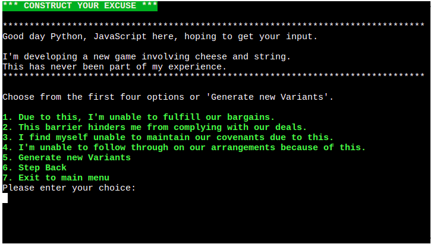
- If select one from first four options, add selected variant to the result and show sixth step of excuse generator page.

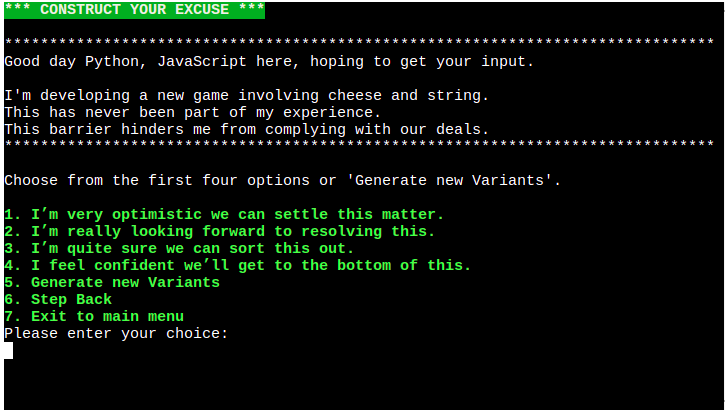
- If select one from first four options, add selected variant to the result and show seventh step of excuse generator page.

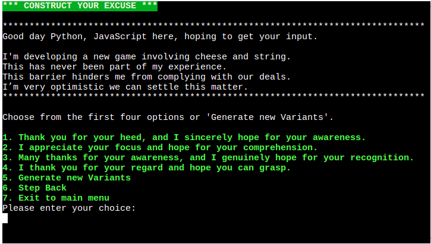
- If select one from first four options, add selected variant to the result and show eighth step of excuse generator page.

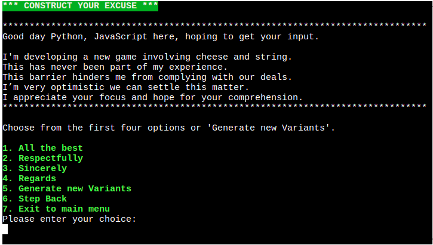
- If select one from first four options, add selected variant to the result and show result excuse page.

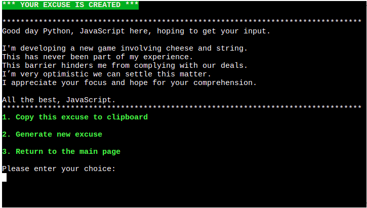
- If select first option "Copy this excuse to clipboard" copy result excuse to clipboard.
#### Second main page option
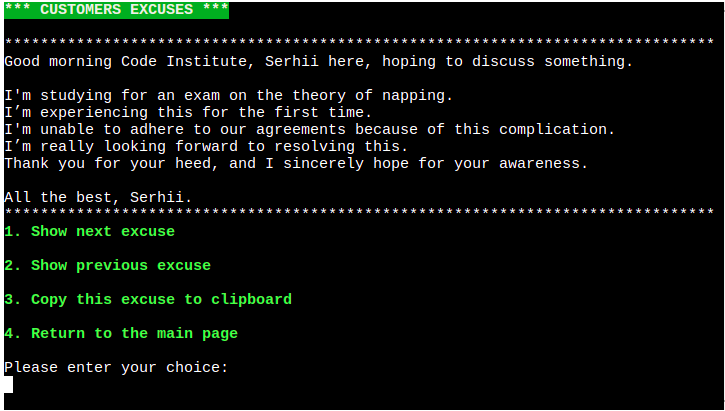
- If select first option get next customer excuse.
- If select second option get previous customer excuse.
- If select third option "Copy this excuse to clipboard" copy selected excuse to clipboard.
#### Third main page option
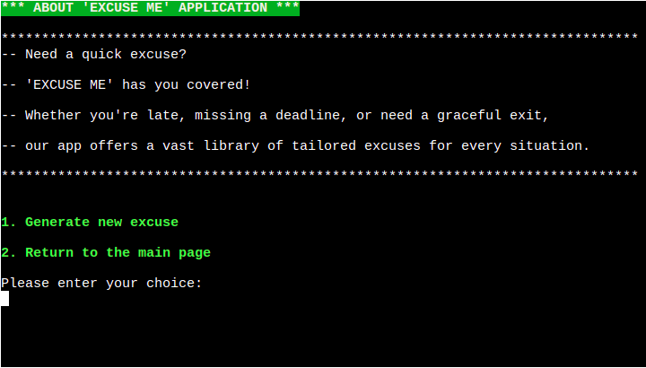
- Show information about application.
- If select first option takes to the excuse generator page.

### Error Handling
- In application added two type of input validators: Number input validator and Text input validator
- When user set invalid value to the Number input validator, set the error.

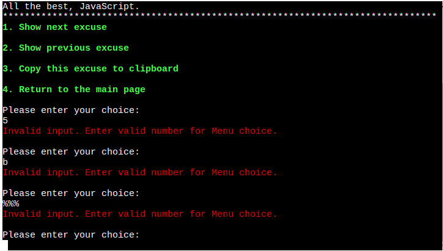

- When user set invalid value to the Text input validator, set the error.

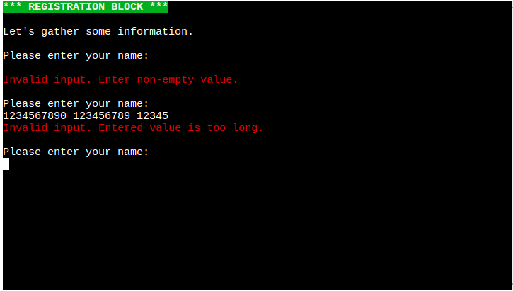

## Testing

### Feature testing

### Validator Testing
-   Used [CI Python Linter](https://pep8ci.herokuapp.com/) to test run.py the code.
-   Result: run.py had no errors or warnings.
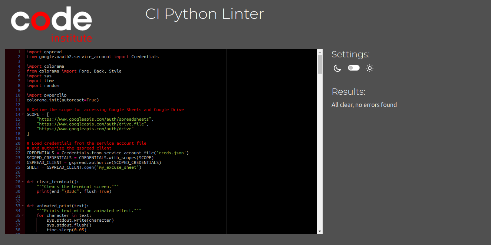

## Deployment

### Page Deployment
-   The app was deployed with Heroku following these steps:
    -   After creating a Heroku account, click "New" to create a new app from the dashboard.
    -   Create a name of the app, that needs to be unique, and select your region. Press "Create app"
    -   Go to settings and add the necessary Config_vars and build packs. Make sure that the build packs are set to "Python" and "NodeJS", in that order.
    -   Go to Deploy tab and scroll down to Deployment Method.
    -   Select GitHub and search for your GitHub repository.
    -   Scroll down to deploy options.
    -   For this project the Manual Deploy method was chosen.
    -   Choose main branch and click Deploy Branch. This will deploy the current state of the branch specified.
    -   Now the app is being built and when Deploy to Heroku has a green check mark, the build is finished.
    -   Click View button to open the app in a browser window.

### Cloning of the Repository Code locally
-   Go to the GitHub repository that you want to clone.
-   Click on the Code button located above all the project files.
-   Click on HTTPS and copy the repository link.
-   Open the IDE of your choice and paste the copied git url into the IDE terminal.
-   The project is now created as a local clone.

## Content

### Technologies Used
-   Programming language was Python.

-   Used the following Libraries:
    - gspread.
    - colorama.
    - sys.
    - time.
    - random
    - pyperclip
- GitHub was used to store the repository for submission.

- Heroku was used to deploy the live version of the terminal.
## Credits

Our project wouldn't have been possible without the invaluable contributions from various sources:

- **Irish Government**: I extend my sincere appreciation to the Irish government for their generous support and
  sponsorship, which played a vital role in the success of this project.
- **Code Institute**: A heartfelt thank you to Code Institute for their educational resources, which equipped me with
  the skills and knowledge necessary to bring this project to fruition.
- **Mentorship**: Special gratitude goes to my mentor, Sheryl Goldberg, whose unwavering support propelled me forward,
  turning challenges into opportunities for growth.
- **Personal Contributions**: My own dedication and expertise shaped this project's success, from conceptualization to
  execution.
- **Community Support**: I'm thankful for the vibrant developer community whose discussions, tutorials, and open-source
  contributions inspired and informed my work.