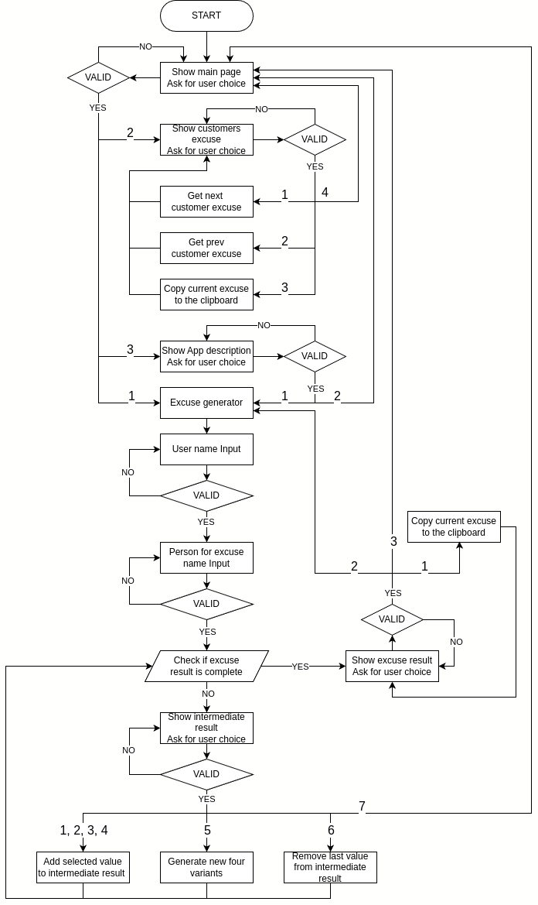

# Excuse me!

"Excuse me" a Python terminal application deployed on Heroku.
The Excuse Generator App is a fun application designed to help users create unique and plausible excuses for any situation.
Whether you're looking to avoid a meeting, skip an event, or simply get out of a tricky situation, our app has got you covered.

The deployed version of the app can be accessed [here](https://excuse-me-fe33fb7ffa8d.herokuapp.com/)

Google Sheet (view only) [here.](https://docs.google.com/spreadsheets/d/1gNPjJa_Dcd1mdzmPWuY7RFV419DvwEJb8JBrkBt6M9g/edit?usp=sharing)

## User Experience (UX)

### Site Purpose
Our site is dedicated to providing users with a quick and easy way to create convincing excuses for any situation.
Whether you need a way out of a work meeting, an excuse for being late to a social event, or just a fun reason to avoid a task, Excuse Me has you covered.
### Audience
Excuse Me is perfect for anyone needing a quick, creative excuse, including:

- Professionals: Get out of meetings, extend deadlines, or take personal days with work-related excuses.
- Students: Find excuses for being late, missing homework, or taking a break from studies.
- Social Butterflies: Avoid social events or awkward situations with ease.
- Busy Parents: Generate excuses for school events, family gatherings, and more.
- Anyone in a Pinch: Handle unexpected situations with ready-made excuses.
- No matter who you are, Excuse Me helps you navigate life's little challenges with creativity and humor.

### User Goals
At Excuse Me, we aim to help our users achieve their goals by providing a simple and effective excuse generation tool. Our users come to us with the following goals:

- Save Time: Quickly generate excuses without the hassle of thinking them up yourself.
- Avoid Awkward Situations: Seamlessly navigate tricky or uncomfortable scenarios with believable excuses.
- Reduce Stress: Alleviate the pressure of finding a way out of commitments or responsibilities.
- Add Humor to Life: Enjoy the fun and creativity of using and sharing amusing excuses.

### Flowchart

## Features

### Error Handling

## Testing

### Feature testing

### Validator Testing

## Deployment

### Version Control
-   The site was created using Gitpod editor and pushed to Github to the remote repository 'excuse-me'.
-   Git commands were used throughout the development to push the code to the remote repository. The following git commands were used:
    -   git add .  - to add the files to the staging area before being committed.
    -   git commit -m "commit message" - to commit changes to the local repository queue that are ready for the final step.
    -   git push - to push all committed code to the remote repository on Github.

### Page Deployment
-   The app was deployed with Heroku following these steps:
    -   After creating a Heroku account, click "New" to create a new app from the dashboard.
    -   Create a name of the app, that needs to be unique, and select your region. Press "Create app"
    -   Go to settings and add the necessary Config_vars and buildpacks. Make sure that the buildpacks are set to "Python" and "NodeJS", in that order.
    -   Go to Deploy tab and scroll down to Deployment Method.
    -   Select GitHub and search for your GitHub repository.
    -   Scroll down to deploy options.
    -   For this project the Manual Deploy method was chosen.
    -   Choose main branch and click Deploy Branch. This will deploy the current state of the branch specified.
    -   Now the app is being built and when Deploy to Heroku has a green check mark, the build is finished.
    -   Click View button to open the app in a browser window.

### Cloning of the Repository Code locally
-   Go to the Github repository that you want to clone.
-   Click on the Code button located above all the project files.
-   Click on HTTPS and copy the repository link.
-   Open the IDE of your choice and and paste the copied git url into the IDE terminal.
-   The project is now created as a local clone.

## Content

### Technologies Used

## Credits
