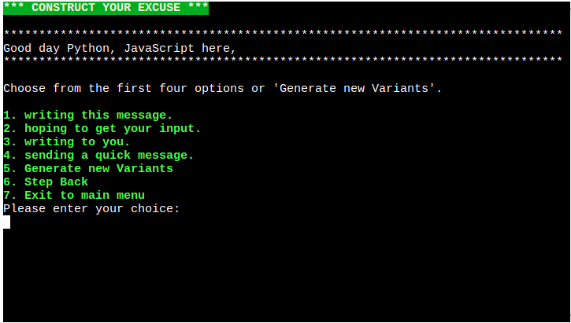

# Excuse me!

"Excuse me" a Python terminal application deployed on Heroku.
The Excuse Generator App is a fun application designed to help users create unique and plausible excuses for any situation.
Whether you're looking to avoid a meeting, skip an event, or simply get out of a tricky situation, our app has got you covered.

The deployed version of the app can be accessed [here](https://excuse-me-fe33fb7ffa8d.herokuapp.com/)

Google Sheet (view only) [here.](https://docs.google.com/spreadsheets/d/1gNPjJa_Dcd1mdzmPWuY7RFV419DvwEJb8JBrkBt6M9g/edit?usp=sharing)

## User Experience (UX)

### Site Purpose
Our site is dedicated to providing users with a quick and easy way to create convincing excuses for any situation.
Whether you need a way out of a work meeting, an excuse for being late to a social event, or just a fun reason to avoid a task, Excuse Me has you covered.
### Audience
Excuse Me is perfect for anyone needing a quick, creative excuse, including:

- Professionals: Get out of meetings, extend deadlines, or take personal days with work-related excuses.
- Students: Find excuses for being late, missing homework, or taking a break from studies.
- Social Butterflies: Avoid social events or awkward situations with ease.
- Busy Parents: Generate excuses for school events, family gatherings, and more.
- Anyone in a Pinch: Handle unexpected situations with ready-made excuses.
- No matter who you are, Excuse Me helps you navigate life's little challenges with creativity and humor.

### User Goals
At Excuse Me, we aim to help our users achieve their goals by providing a simple and effective excuse generation tool. Our users come to us with the following goals:

- Save Time: Quickly generate excuses without the hassle of thinking them up yourself.
- Avoid Awkward Situations: Seamlessly navigate tricky or uncomfortable scenarios with believable excuses.
- Reduce Stress: Alleviate the pressure of finding a way out of commitments or responsibilities.
- Add Humor to Life: Enjoy the fun and creativity of using and sharing amusing excuses.

### Flowchart

## Features
- At the main page, select one of three options.

#### First main page option
- First main page option takes to the excuse generator page.
- Script start from input for username.

- If the username is valid, show input to enter the name to excuse.

- If the name to excuse is valid, show excuse generator page.

- If select fifth option "Generate new Variants" at excuse generator page set new four options to the menu.
- If select one from first four options, add selected variant to the result and show second step of excuse generator page.

- From this step and all next steps present option "Step Back" which return to previous page and remove last item from excuse result.
- If select one from first four options, add selected variant to the result and show third step of excuse generator page.

- If select one from first four options, add selected variant to the result and show fourth step of excuse generator page

- If select one from first four options, add selected variant to the result and show fifth step of excuse generator page.

- If select one from first four options, add selected variant to the result and show sixth step of excuse generator page.

- If select one from first four options, add selected variant to the result and show seventh step of excuse generator page.

- If select one from first four options, add selected variant to the result and show eighth step of excuse generator page.

- If select one from first four options, add selected variant to the result and show result excuse page.

- If select first option "Copy this excuse to clipboard" copy result excuse to clipboard.
#### Second main page option

- If select first option get next customer excuse.
- If select second option get previous customer excuse.
- If select third option "Copy this excuse to clipboard" copy selected excuse to clipboard.
#### Third main page option

- Show information about application.
- If select first option takes to the excuse generator page.

### Error Handling
- In application added two type of input validators: Number input validator and Text input validator
- When user set invalid value to the Number input validator, set the error.

- When user set invalid value to the Text input validator, set the error.

## Testing

### Manual testing

#### 1. Initialization and Setup
- Verified the application initialized without errors.
- Ensured the Google Sheets credentials were correctly loaded and authorized.

#### 2. Main Menu
- Verified the main menu was displayed with the following options:
1. Generate new excuse
2. Show already generated excuses
3. Show information about application

#### 3. Generate New Excuse
- Selected "Generate new excuse" from the main menu.
- Verified the prompt for name input appeared.
- **Name Inputs:**
    - Entered a valid name and verified.
    - Entered an empty name and verified an appropriate error message was displayed.
    - Entered a very long name (exceeding expected length) and verified an appropriate error message was displayed.
    - Entered special characters in the name and verified the excuse was generated correctly or an appropriate error message was displayed.

- **Menu Options:**
    - Verified the following menu options were available after names selecting:
        - 1: Part 1: Randomly get text from the excuse template.
        - 2: Part 2: Randomly get text from the excuse template.
        - 3: Part 3: Randomly get text from the excuse template.
        - 4: Part 4: Randomly get text from the excuse template.
        - 5: Generate new Variants: Replace the first four variants with new ones.
        - 6: Step back: Remove the last variant from the result and return to the previous step.
        - 7: Return to the main menu.
    - Selected "Part 1" added selected text to the excuse result and switch to the next step.
    - Selected "Part 2" added selected text to the excuse result and switch to the next step.
    - Selected "Part 3" added selected text to the excuse result and switch to the next step.
    - Selected "Part 4" added selected text to the excuse result and switch to the next step.
    - Selected "Generate new Variants" and verified the first four parts were replaced with new ones.
    - Selected "Step back" the system returned to the previous step.
    - Selected "Return to the main menu" and verified the system returned to the main menu.
- Ensured the excuse was appended to the Google Sheet.
- Checked that the system correctly returned to the excuse result menu after generating the excuse.

#### 4. Show already generated excuses
- Selected "Show already generated excuses" from the main menu.
- Verified the Saved Excuses page was displayed with the following options:
1. Show next excuse
2. Show previous excuse
3. Copy this excuse to clipboard
4. Return to the main page
- Verified the list of saved excuses was displayed.
- Navigated through the excuses using "Show next excuse" and "Show previous excuse" options.
- Tested the "Copy this excuse to clipboard" functionality and verified the excuse was copied.
- Ensured the "Return to the main page" option worked correctly.

#### 5. About Page
- Selected "Show information about application" from the main menu.
- Verified the About page was displayed with the following options:
1. Generate new excuse
2. Return to the main page
- Verified the information about the application was correctly displayed.
- Tested the navigation options: "Generate new excuse" and "Return to the main page."

#### 6. Clipboard Functionality
- Tested the "Copy this excuse to clipboard" option and verified the excuse text was correctly copied to the clipboard.
- Ensured the clipboard content matched the displayed excuse.

### Validator Testing
-   Used [CI Python Linter](https://pep8ci.herokuapp.com/) to test run.py the code.
-   Result: run.py had no errors or warnings.

## Deployment

### Deploying the Application
-   The application was deployed on Heroku by following these steps:
    -   Create a Heroku account, then click "New" on the dashboard to initiate a new app.
    -   Choose a unique name for your app, select your region, and click "Create app".
    -   Navigate to the settings, add the necessary Config Vars, and set the build packs to "Python" and "Node.js" (in that order).
    -   Go to the Deployment tab, and scroll down to Deployment Method.
    -   Select GitHub and connect to your GitHub repository.
    -   Scroll down to the deployment options.
    -   Select the main branch and click "Deploy Branch". This deploys the current state of the selected branch.
    -   The app will now be built. Once the deployment to Heroku is complete (indicated by a green check mark), the build is finished.
    -   Add environment variable: "PORT" : 8000"
    -   Add environment variable: "CREDS" : { Your JSON object with credentials from Google service account }"
    -   Click the "View" button to open the app in a browser window.

### Cloning the Repository Locally
-   Go to the GitHub repository you want to clone.
-   Click the "Code" button above the project files.
-   Select "HTTPS" and copy the repository link.
-   Open your preferred IDE and paste the copied Git URL into the terminal.
-   The project will now be cloned to your local machine.

## Content

### Technologies Used
-   Programming language Python.

- **Used the following Libraries:**
  - **gspread**: A Python API for Google Sheets that allows for reading, writing, and updating spreadsheets.
  - **colorama**: A library for producing colored terminal text and formatting in Python applications.
  - **sys**: Provides access to system-specific parameters and functions, such as command-line arguments and standard I/O.
  - **time**: A module for working with time-related functions, such as sleeping, measuring, and manipulating time.
  - **random**: A module for generating random numbers, shuffling sequences, and selecting random elements.
  - **pyperclip**: A cross-platform Python module for copying and pasting text to and from the clipboard.
- GitHub was used to store the repository for submission.
- Heroku was used to deploy the live version of the terminal.
## Credits

Our project wouldn't have been possible without the invaluable contributions from various sources:

- **Irish Government**: I extend my sincere appreciation to the Irish government for their generous support and
  sponsorship, which played a vital role in the success of this project.
- **Code Institute**: A heartfelt thank you to Code Institute for their educational resources, which equipped me with
  the skills and knowledge necessary to bring this project to fruition.
- **Mentorship**: Special gratitude goes to my mentor, Sheryl Goldberg, whose unwavering support propelled me forward,
  turning challenges into opportunities for growth.
- **Personal Contributions**: My own dedication and expertise shaped this project's success, from conceptualization to
  execution.
- **Community Support**: I'm thankful for the vibrant developer community whose discussions, tutorials, and open-source
  contributions inspired and informed my work.